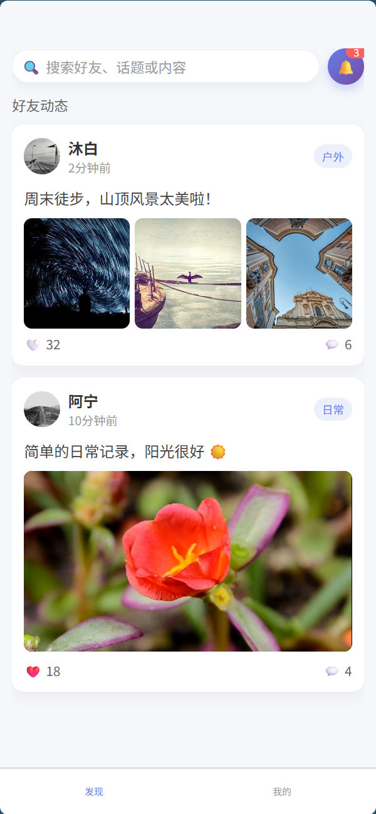

# Moments - 多媒体展示小程序

## 项目概述

**Moments** 是一个现代化的多媒体展示软件，类似于朋友圈的展示功能。该项目采用前后端分离架构，为用户提供便捷的多媒体内容展示体验，同时为管理员提供强大的后台管理功能。

## 项目特色

- 🎯 **用户友好**: 简洁直观的用户界面，类似朋友圈的使用体验
- 📱 **多端支持**: 小程序前端 + Web管理后台
- 🖼️ **多媒体支持**: 支持图片、视频等多种媒体格式展示
- 🔒 **安全可靠**: 完善的用户认证和权限管理系统
- ⚡ **高性能**: 基于 Django REST Framework 构建的高效后端API
- 🎨 **现代化设计**: 采用 Vue.js 技术栈，界面美观专业

## 技术架构

### 前端部分
- **用户端**: 基于 uni-app 的小程序前端
  - 微信小程序
  - 现代化的 UI 设计，流畅的用户体验
  - 多媒体内容展示和交互功能

- **管理端**: Web管理后台
  
  - 完整的内容管理和用户管理功能

### 后端部分
- **框架**: Django REST Framework
- **数据库**: SQLite (开发)
- **认证**: Token-based 认证系统
- **API**: RESTful API 设计规范


## 功能模块

### 用户功能
- 📸 多媒体内容发布和展示
- 👍 点赞、评论互动功能
- 🔍 内容浏览和搜索
- 👤 个人资料管理
- 🔐 用户注册、登录、认证

### 管理功能
- 📊 数据统计和可视化
- 👥 用户管理和权限控制
- 🔧 API接口管理和监控

## 快速开始

### 环境要求
- Python 3.8+
- Node.js 14+
- SQLite 3.x

### 后端启动
```bash
cd DjangoProject
pip install -r requirements.txt
python manage.py migrate
python manage.py runserver 8000
```


## API文档

详细的API文档请参考 [API_README.md](./DjangoProject/API_README.md)

## 项目结构

```
Moments/
├── DjangoProject/          # Django后端项目
│   ├── api/               # API应用
│   ├── DjangoProject/     # 主项目配置
│   └── templates/         # 模板文件
├── frontend/              # 前端项目
│   └── uni-preset-vue-vite/  # uni-app小程序前端
└── README.md             # 项目说明文档
```

## 开发团队

本项目由专业的开发团队精心打造，致力于为用户提供最佳的多媒体展示体验。

## 许可证

MIT License - 详见 [LICENSE](LICENSE) 文件

## 联系方式

如有问题或建议，欢迎联系我们：


---

**Moments** - 记录美好瞬间，分享精彩生活！